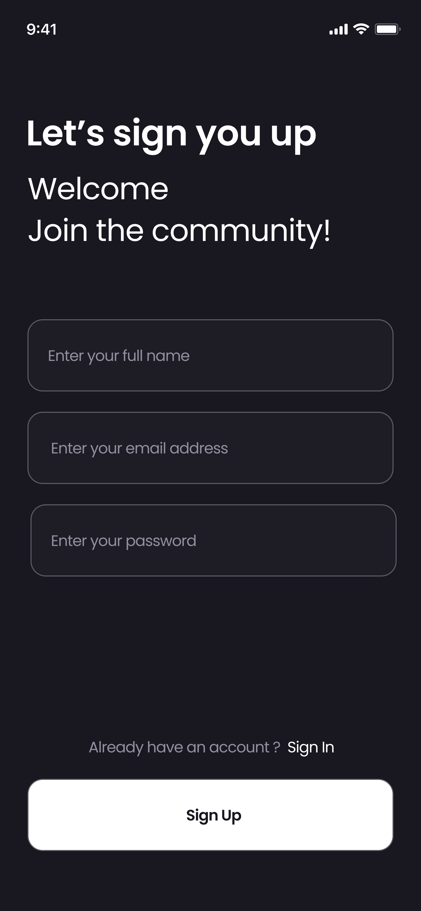
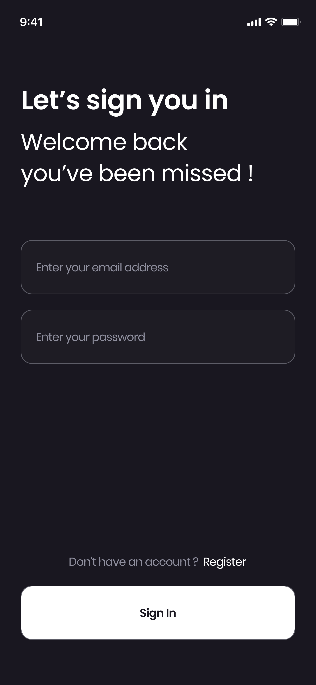
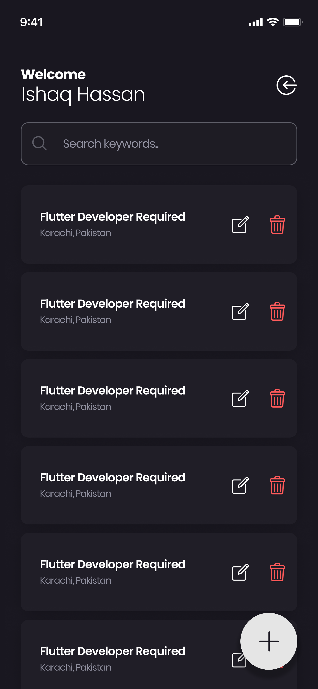
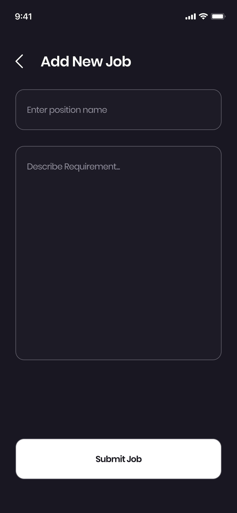
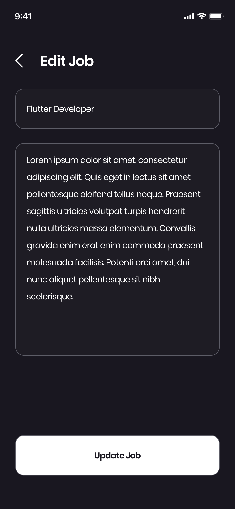

# A Job App: Flutter MVVM with GetX

A modern job listing and management application built using Flutter, following the **Model-View-ViewModel (MVVM)** architectural pattern for clean separation of concerns and maintainable code. State management and routing are handled by the **GetX** package.

---

## 🖼️ Screenshots

Get a quick look at the main screens designed for the application.

| Register Screen | Login Screen | Job Listing Screen | Add New Job Screen | Edit Job Screen |
| :---: | :---: | :---: | :---: | :---: |
|  |  |  |  |  |

---

## 🙏 Acknowledgment

**A big thank you to Sir Ishaq Hassan for the invaluable mentorship and guidance** throughout the development and learning of Flutter concepts, which made the creation of this helpful, architecturally sound application possible.

---

## ✨ Features

* **User Authentication:** Registration and Login screens (UI ready).
* **Job Management:** View a list of jobs and add new job listings.
* **Responsive UI (Adaptive):** Layouts designed to look great across different screen sizes.
* **Clean Architecture:** Strict adherence to MVVM principles using Controllers (ViewModels) and Bindings.
* **Centralized Assets:** Reusable widgets (`AppTextField`, `AppButton`) and color constants (`AppColors`).

---

## 🛠️ Tech Stack & Architecture

### Core Technologies
* **Framework:** Flutter
* **Language:** Dart
* **State Management/Routing:** GetX

### Project Structure (MVVM)

The project follows a modular MVVM structure:

| Folder | Purpose | Key Files |
| :--- | :--- | :--- |
| `lib/mvvm/view` | Houses all the **Screens** (Views) of the application. | `job_listing_screen.dart`, `register_screen.dart`, etc. |
| `lib/mvvm/viewModel` | Contains the **Controllers** (ViewModels) and **Bindings** (Dependency Injection). | `auth_binding.dart`, `registration_controller.dart` |
| `lib/widget` | Houses common, **reusable UI components**. | `app_button.dart`, `app_textfield.dart` |
| `lib/config/utils` | Contains non-UI utilities like color constants and responsive helpers. | `app_colors.dart`, `app_responsive.dart` |
| `lib/config/routes` | Contains Navigations | `app_pages.dart`, `app_routes.dart` |

---

## ⚙️ Setup and Installation

### Prerequisites
* [Flutter SDK](https://flutter.dev/docs/get-started/install) installed and configured.
* A connected IDE (VS Code or Android Studio) with Flutter and Dart plugins.

### Steps

1.  **Clone the repository:**
    ```bash
    git clone [your-repo-link]
    cd job_app
    ```

2.  **Install dependencies:**
    The project relies on `get`. Run the following command:
    ```bash
    flutter pub get
    ```

3.  **Run the application:**
    ```bash
    flutter run
    ```
    The application will start on the device/emulator selected in your IDE.

---

## 🗺️ Routing

The application uses GetX named routes, defined centrally in `app_pages.dart` using the `Routes` abstract class.

| Route Name | Path Constant | Screen | Binding |
| :--- | :--- | :--- | :--- |
| Initial/Register | `/` or `/register` | `RegisterScreen` | `AuthBinding` |
| Login | `/login` | `LoginScreen` | `AuthBinding` |
| Job List | `/jobs-listing` | `JobListingScreen` | `AuthBinding` (Placeholder) |
| Add Job | `/add-job` | `AddJobScreen` | `AuthBinding` (Placeholder) |

---

## 🎨 Reusable Components

We rely on the following widgets to maintain design consistency:

* **`AppTextField`**: A standardized text input field using `AppColors.textFieldBackground`.
* **`AppButton`**: A reusable, white-filled submission button using `AppColors.white` and handling optional loading states.
* **`AppColors`**: A utility class holding all primary color constants (e.g., `primaryBackground`, `white`, `red`).

---

## 📝 To Do & Next Steps

1.  **Implement Logic:** Connect `RegistrationController` and `LoginController` to an actual service layer (API/Firebase).
2.  **Job Tiles:** Create the specific **`JobTile`** widget to replace the placeholder in `JobListingScreen.dart`.
3.  **Refine Responsiveness:** Utilize the `AppResponsive` helper class across all screens for optimal scaling.

---

A few resources to get you started if this is your first Flutter project:

- [Lab: Write your first Flutter app](https://docs.flutter.dev/get-started/codelab)
- [Cookbook: Useful Flutter samples](https://docs.flutter.dev/cookbook)

For help getting started with Flutter development, view the
[online documentation](https://docs.flutter.dev/), which offers tutorials,
samples, guidance on mobile development, and a full API reference.
